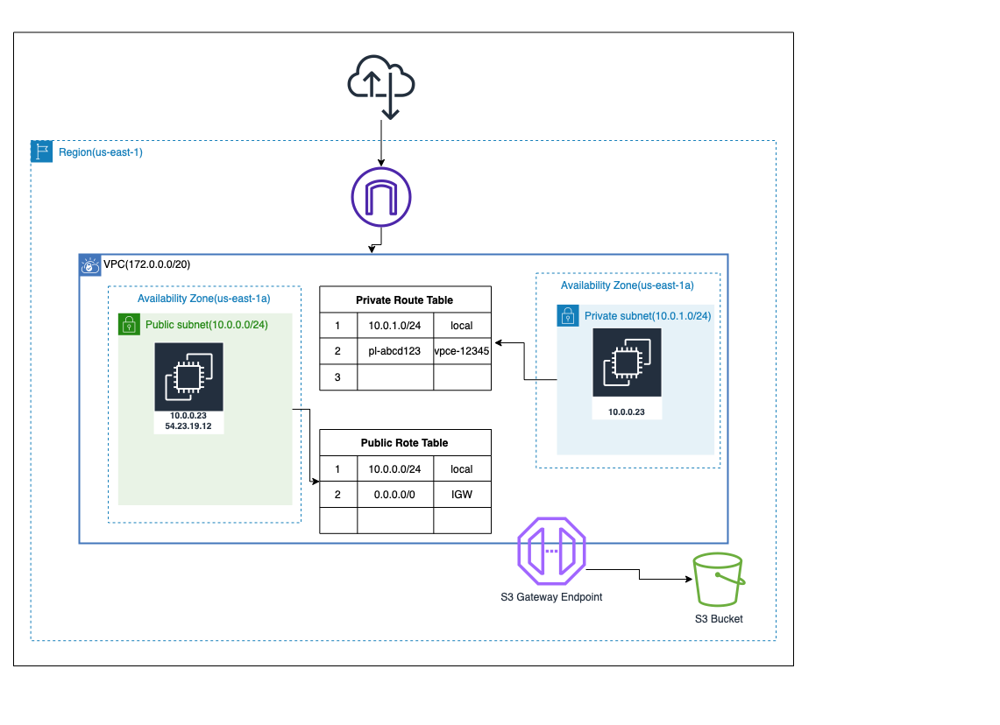

<!-- BEGIN_TF_DOCS -->
#Project: VPC Endpoint S3 Gateway
##Architecture 

## Requirements

| Name | Version |
|------|---------|
| <a name="requirement_aws"></a> [aws](#requirement\_aws) | ~> 3.70 |
| <a name="requirement_local"></a> [local](#requirement\_local) | 2.1.0 |
| <a name="requirement_tls"></a> [tls](#requirement\_tls) | 3.1.0 |

## Providers

| Name | Version |
|------|---------|
| <a name="provider_aws"></a> [aws](#provider\_aws) | 3.70.0 |
| <a name="provider_local"></a> [local](#provider\_local) | 2.1.0 |
| <a name="provider_tls"></a> [tls](#provider\_tls) | 3.1.0 |

## Modules

No modules.

## Resources

| Name | Type |
|------|------|
| [aws_eip.eip](https://registry.terraform.io/providers/hashicorp/aws/latest/docs/resources/eip) | resource |
| [aws_iam_instance_profile.instance_profile](https://registry.terraform.io/providers/hashicorp/aws/latest/docs/resources/iam_instance_profile) | resource |
| [aws_iam_role.instance_profile_role](https://registry.terraform.io/providers/hashicorp/aws/latest/docs/resources/iam_role) | resource |
| [aws_iam_role_policy.instance_profile_role_policy](https://registry.terraform.io/providers/hashicorp/aws/latest/docs/resources/iam_role_policy) | resource |
| [aws_instance.private_instance](https://registry.terraform.io/providers/hashicorp/aws/latest/docs/resources/instance) | resource |
| [aws_instance.public_instance](https://registry.terraform.io/providers/hashicorp/aws/latest/docs/resources/instance) | resource |
| [aws_internet_gateway.internet_gateway](https://registry.terraform.io/providers/hashicorp/aws/latest/docs/resources/internet_gateway) | resource |
| [aws_key_pair.key_pair](https://registry.terraform.io/providers/hashicorp/aws/latest/docs/resources/key_pair) | resource |
| [aws_route_table.private_route_table](https://registry.terraform.io/providers/hashicorp/aws/latest/docs/resources/route_table) | resource |
| [aws_route_table.public_route_table](https://registry.terraform.io/providers/hashicorp/aws/latest/docs/resources/route_table) | resource |
| [aws_route_table_association.private_route_table_mapping](https://registry.terraform.io/providers/hashicorp/aws/latest/docs/resources/route_table_association) | resource |
| [aws_route_table_association.public_route_table_mapping](https://registry.terraform.io/providers/hashicorp/aws/latest/docs/resources/route_table_association) | resource |
| [aws_s3_bucket.bucket](https://registry.terraform.io/providers/hashicorp/aws/latest/docs/resources/s3_bucket) | resource |
| [aws_s3_bucket_public_access_block.pab](https://registry.terraform.io/providers/hashicorp/aws/latest/docs/resources/s3_bucket_public_access_block) | resource |
| [aws_security_group.private_sg](https://registry.terraform.io/providers/hashicorp/aws/latest/docs/resources/security_group) | resource |
| [aws_security_group.public_sg](https://registry.terraform.io/providers/hashicorp/aws/latest/docs/resources/security_group) | resource |
| [aws_subnet.private_subnet](https://registry.terraform.io/providers/hashicorp/aws/latest/docs/resources/subnet) | resource |
| [aws_subnet.public_subnet](https://registry.terraform.io/providers/hashicorp/aws/latest/docs/resources/subnet) | resource |
| [aws_vpc.vpc](https://registry.terraform.io/providers/hashicorp/aws/latest/docs/resources/vpc) | resource |
| [aws_vpc_endpoint.s3](https://registry.terraform.io/providers/hashicorp/aws/latest/docs/resources/vpc_endpoint) | resource |
| [aws_vpc_endpoint_route_table_association.vpce_route_table_mapping](https://registry.terraform.io/providers/hashicorp/aws/latest/docs/resources/vpc_endpoint_route_table_association) | resource |
| [local_file.key](https://registry.terraform.io/providers/hashicorp/local/2.1.0/docs/resources/file) | resource |
| [tls_private_key.private_key](https://registry.terraform.io/providers/hashicorp/tls/3.1.0/docs/resources/private_key) | resource |

## Inputs

| Name | Description | Type | Default | Required |
|------|-------------|------|---------|:--------:|
| <a name="input_all_traffic"></a> [all\_traffic](#input\_all\_traffic) | all traffic to public | `string` | `"0.0.0.0/0"` | no |
| <a name="input_ami"></a> [ami](#input\_ami) | AMI ID for ec2 instance, this value changes for each region | `string` | `"ami-0ed9277fb7eb570c9"` | no |
| <a name="input_az"></a> [az](#input\_az) | Availability zone for subnet(a,b,c,d,e,f) | `string` | `"a"` | no |
| <a name="input_private_subnet_cidr"></a> [private\_subnet\_cidr](#input\_private\_subnet\_cidr) | CIDR for private subnet | `string` | `"10.0.1.0/24"` | no |
| <a name="input_public_subnet_cidr"></a> [public\_subnet\_cidr](#input\_public\_subnet\_cidr) | CIDR for public subnet | `string` | `"10.0.0.0/24"` | no |
| <a name="input_region"></a> [region](#input\_region) | AWS region for provider | `string` | `"us-east-1"` | no |
| <a name="input_vpc_cidr"></a> [vpc\_cidr](#input\_vpc\_cidr) | VPC CIDR | `string` | `"10.0.0.0/16"` | no |

## Outputs

| Name | Description |
|------|-------------|
| <a name="output_private_ip"></a> [private\_ip](#output\_private\_ip) | n/a |
| <a name="output_public_ip"></a> [public\_ip](#output\_public\_ip) | n/a |
<!-- END_TF_DOCS -->

## Example output

```Shell Script
#public instance 
 ssh -i narenkp.pem ec2-user@54.173.24.58
Last login: Mon Jan  3 11:39:23 2022 from 104.145.93.107

       __|  __|_  )
       _|  (     /   Amazon Linux 2 AMI
      ___|\___|___|

https://aws.amazon.com/amazon-linux-2/
[ec2-user@ip-10-0-0-148 ~]$ aws s3 ls 
2022-01-03 11:20:08 sample-bucket-20220102050000
2022-01-03 11:48:26 this-is-another-bucket
[ec2-user@ip-10-0-0-148 ~]$ echo "hey how are you ?"> b.txt
[ec2-user@ip-10-0-0-148 ~]$ aws s3 cp b.txt s3://sample-bucket-20220102050000/
upload: ./b.txt to s3://sample-bucket-20220102050000/b.txt        
[ec2-user@ip-10-0-0-148 ~]$ aws s3 cp b.txt s3://this-is-another-bucket/
upload: ./b.txt to s3://this-is-another-bucket/b.txt              
#able to upload file

#private Instance
[ec2-user@ip-10-0-0-148 ~]$ ssh -i narenkp.pem ec2-user@10.0.1.223
Last login: Mon Jan  3 11:39:28 2022 from 10.0.0.148

       __|  __|_  )
       _|  (     /   Amazon Linux 2 AMI
      ___|\___|___|

https://aws.amazon.com/amazon-linux-2/
[ec2-user@ip-10-0-1-223 ~]$ aws s3 ls
2022-01-03 11:20:08 sample-bucket-20220102050000
2022-01-03 11:48:26 this-is-another-bucket
[ec2-user@ip-10-0-1-223 ~]$ echo "some text" > c.txt
[ec2-user@ip-10-0-1-223 ~]$ aws s3 cp c.txt s3://sample-bucket-20220102050000/
upload: ./c.txt to s3://sample-bucket-20220102050000/c.txt        
[ec2-user@ip-10-0-1-223 ~]$ aws s3 cp c.txt s3://this-is-another-bucket/
upload failed: ./c.txt to s3://this-is-another-bucket/c.txt An error occurred (AccessDenied) when calling the PutObject operation: Access Denied
[ec2-user@ip-10-0-1-223 ~]$ 
#unable to able to upload file
```